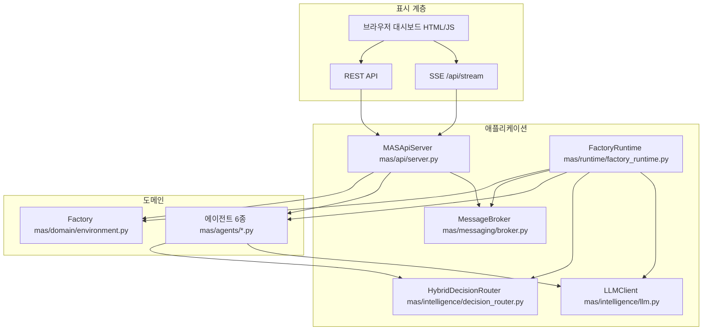

# MAS 프로젝트 총정리 — 구성·구현·운영 (통합 가이드)

> **한 문서로**: 이 저장소가 **무엇인지**, **폴더가 어떻게 나뉘는지**, **코드가 어떤 방식으로 구현됐는지**, **어떻게 실행·모니터링하는지**를 정리합니다.  
> 세부 스펙·환경 변수 전체·프로토콜 ID는 **`MAS_SYSTEM_REFERENCE.md`**, 다이어그램·역사는 **`ARCHITECTURE.md`**, 비기술 요약은 **`OVERVIEW.md`** 를 참고하세요.

**버전**: 패키지 `mas.__version__` = **5.0.0**  
**마지막 문서 갱신**: 2026-04-08 (저장소 코드 기준)

---

## 1. 이 프로젝트는 무엇인가

| 항목 | 내용 |
|------|------|
| **이름** | Manufacturing Multi-Agent System (MAS) v5 |
| **도메인** | 자동차 부품(브레이크 관련) **가상 공장** — **6공정 생산 라인** 시뮬레이션 |
| **에이전트** | 역할이 다른 **6종** — EA(설비), QA(품질), SA(자재), DA(수요), IA(재고), PA(계획) |
| **협업** | **메시지 브로커**(Pub/Sub) + PA 중심 **CNP(Contract Net)** 협상 |
| **지능** | **하이브리드 의사결정 라우터** — 규칙/임계 우선, 조건부 **LLM** 상황 분석 (전 틱 전원 호출 아님) |
| **표시** | 선택적으로 **FastAPI** + 브라우저 **대시보드** (내장 HTML/JS, 빌드 도구 없음), **REST 폴링 + SSE** |
| **실험** | **YAML 시나리오**·`run_scenario.py` 등으로 배치 실행·결과 JSON (`main.py` 와 목적이 다름) |

한 문장으로: **같은 프로세스 안에서 공장이 틱으로 돌아가고, 여섯 에이전트가 스냅샷을 보고 판단·메시지를 주고받으며, 웹으로 상태를 볼 수 있는 제조 MAS 시뮬레이터**입니다.

---

## 2. 저장소·패키지 구성 (어디에 무엇이 있나)

### 2.1 루트 파일

| 경로 | 역할 |
|------|------|
| `main.py` | **권장 진입점** — 브로커·공장·에이전트·런타임·API 기동 |
| `run_scenario.py` | 시나리오/배치 실험 진입 (상시 시뮬과 분리) |
| `requirements.txt` | Python 의존성 (FastAPI, uvicorn, openai, paho-mqtt, pyyaml, langgraph 등) |
| `.env` / `.env.example` | `MAS_*` 등 설정 (예시는 `.env.example`) |
| `tests/` | pytest 단위·통합 테스트 |

### 2.2 `mas/` 패키지 — 권장 레이어 (`mas/__init__.py` 주석과 동일)

| 경로 | 책임 |
|------|------|
| **`mas/domain/`** | 공장 환경 `Factory`, 워크센터·센서, 수요·재고, `manufacturing_context`, `plant_data_model` |
| **`mas/messaging/`** | `MessageBroker`, 메시지 봉투, (선택) **MQTT** 브릿지 |
| **`mas/agents/`** | 6종 에이전트, `BaseAgent`, `equipment_sub/`, `planning_sub/`, `qa_sub/` |
| **`mas/adapters/`** | 외부 연동 경계용 Protocol (`base.py` 등) |
| **`mas/intelligence/`** | `HybridDecisionRouter`, `LLMClient`(**`audit_log`**), 스냅샷 보강, `operational_decision_card`, `monitoring_qa`, `mas_overview`, `collaboration_view`, 제어·팀 레지스트리 등 |
| **`mas/protocol/`** | SRA, CNP 세션, LangGraph, **`cnp_comparison`**(제안 비교 블록 병합) |
| **`mas/runtime/`** | **`FactoryRuntime`** (스레드·틱·에이전트 루프), 시나리오 런타임 |
| **`mas/scenario/`** | YAML 로더 등 |
| **`mas/tools/`** | 모형·도구 |
| **`mas/core/`** | **`config`** (`MAS_*` 설정), 로깅 |
| **`mas/api/`** | **`MASApiServer`**, `DASHBOARD_HTML`, REST·SSE |

### 2.3 루트 shim (하위 호환)

`main.py` 는 익숙한 짧은 import를 씁니다. 예: `from mas.environment import Factory` → 실제 구현은 **`mas/domain/environment.py`** 이며, `mas/environment.py` 는 re-export입니다.  
`mas/config.py` → **`mas/core/config.py`** (`get_settings`).  
에이전트도 `mas/equipment_agent.py` 등이 **`mas/agents/`** 를 가리키는 패턴이 있을 수 있어, **새 코드는 `mas.agents.*` / `mas.domain.*` 를 권장**합니다.

---

## 3. 아키텍처 한 장 (계층)

**핵심**: 대시보드 숫자는 **같은 프로세스**의 `Factory` + 에이전트 + 브로커에서 옵니다. **API만 단독**으로 띄우면 `factory_bound === false` 이고 공장 스냅샷이 비는 것이 정상입니다.

---

## 4. 구현 방식 — 코드가 어떻게 동작하는가

### 4.1 공장(도메인)

- **`Factory`** (`mas/domain/environment.py`)가 **6공정 `line`**, 교대, 자재, WIP, 주문, KPI를 갱신합니다.
- **`get_snapshot()`** 이 에이전트·API용 **단일 스냅샷**을 만듭니다.  
  - JSON 직렬화 호환을 위해 **`mtbf`** 가 고장 이력 없을 때 `null`, 자재 **`days_supply`** 가 비유한일 때 `null` 로 나가도록 처리되어 있습니다 (Starlette `JSONResponse` 는 `inf`/`nan` 비허용).
  - **`business_events`**: `Factory`에 **`BusinessEventStore`**(`mas/domain/business_events.py`)가 붙어 있으며, 스냅샷·에이전트 Sense에 **최근 이벤트 테일**로 노출됩니다.
- **`manufacturing_context`** (`mas/domain/manufacturing_context.py`)는 **`CONTEXT_CONTRACT_VERSION`(현재 2.0)** 과 함께 `identifiers`(site/plant/line/cell·station·equipment·SKU·LOT·order·shift), `temporal`(논리 사이클·sim 시각·`event_time_utc_iso`·`ingest_time_utc_iso`), `kpi_slices`(line / by_station / by_shift / by_sku)를 담는 **1급 표준 계약**입니다. `from_factory_snapshot()` 으로 `Factory.get_snapshot()` 을 변환합니다.
- **에이전트 입력 보강**: `enrich_snapshot_for_agents()` (`mas/domain/agent_snapshot.py`)가 Sense 직전에 호출되어 스냅샷에 **`manufacturing_context`** 및 수집 시각을 붙입니다. 이어서 **`enrich_snapshot_for_router()`** 가 라우터용 파생 지표를 추가합니다 (`mas/protocol/agent_protocol.py`).

### 4.2 런타임

- **`FactoryRuntime`** 이 **ENV-TICK**(공장 사이클), **EVENT-GEN**(확률 이벤트), **AGENT×6** 스레드를 둡니다.
- 스냅샷은 락으로 보호되어 에이전트가 **일관된 읽기**를 합니다.
- 틱 주기는 설정 **`MAS_TAKT_SEC`** (기본 2초 등, `get_settings().takt_sec`).

### 4.3 에이전트 한 사이클 (SRA + 라우터)

- 경로: **`mas/protocol/agent_protocol.py`** 의 **`run_cycle_with_router`**.
- 순서 요약: **`enrich_snapshot_for_agents`** → **Sense** → **`enrich_snapshot_for_router`** → **`HybridDecisionRouter.route`** (규칙 우선, 조건부 LLM) → **Reason** → **Act**.
- **LangGraph** (`mas/protocol/sra_langgraph.py`): 그래프는 `sense → enrich → router → reason → act` **선형** 워크플로로 컴파일되어 한 사이클과 순차 SRA가 동등합니다.  
  - **`MAS_USE_LANGGRAPH=1`**(기본)이고 `langgraph` 패키지가 있으면 그래프 경로, **`ImportError`·그래프 실행 중 예외**면 **자동으로 순차 SRA로 폴백**합니다(운영 안정성).  
  - 그래프는 에이전트·라우터·브로커·`log_fn` 조합별로 **캐시**되며, `log_fn`은 클로저에 묶이므로 캐시 키에 포함됩니다.  
  - **체크포인트·휴먼 인 더 루프·조건부 엣지**는 아직 넣지 않았습니다 — 필요 시 같은 `StateGraph`에 노드/엣지만 확장하면 됩니다.

### 4.4 브로커·CNP

- 메시지는 **`MessageBroker`** 를 경유합니다.
- **PA**가 필요 시 **CNP**로 타 에이전트 제안을 모아 전략을 확정합니다. 제안에는 **`cnp_comparison.merge_into_proposal`** 로 **`comparison`** 메트릭이 붙을 수 있고, `planning_sub`의 **`rank_proposals_by_comparison`** 으로 순위를 정리합니다. 전략에는 **`operational_decision_card`** (`operational_decision_card/v1`)가 포함될 수 있습니다.

### 4.5 API·대시보드

- **`MASApiServer`** (`mas/api/server.py`)가 FastAPI 앱을 만들고, **`DASHBOARD_HTML`** 에 CSS/JS를 인라인으로 넣어 **`GET /`** 한 방에 내려줍니다.
- 프론트는 **2초 폴링**으로 `/api/status`, `/api/factory`, `/api/kpi`, `/api/monitoring`, `/api/agents`, `/api/broker` 를 병렬 호출합니다.
- **생산 라인 도식**은 원칙적으로 `factory.stations` 를 쓰되, 비어 있으면 **`kpi.station_oee`** 또는 **`manufacturing_context.station_ids` + 평균 OEE** 로 폴백합니다.
- 대시보드는 **운영에 필요한 화면만** 남긴 상태입니다: KPI·컨텍스트 바, 생산 라인, 공정 그리드, 에이전트 카드(서브 뷰), 메시지·자재, 예지보전(EA), 시스템(신호 스트립+4카드), 스냅샷 질의.  
  (문서형 `mas_overview` / 협업 맵 / 담당·팀 표 / `data_flow` 단계 카드는 **화면에서 제거**; **`/api/monitoring` JSON**에는 여전히 많은 키가 포함될 수 있어 외부 연동용으로 활용 가능.)

### 4.6 질의 API

- **`POST /api/ask`** → **`mas/intelligence/monitoring_qa.py`**: 모니터링 페이로드를 축약한 컨텍스트로 LLM 또는 규칙 기반 답변. 스냅샷에 없는 수치는 답하지 않도록 프롬프트가 잡혀 있습니다.

---

## 5. `python main.py` 실행 순서

| 순서 | 하는 일 | 주요 파일/객체 |
|------|---------|----------------|
| 1 | `.env` / `MAS_*` 로드 | `mas/core/config.py` (`get_settings`) — `main.py` 는 `mas.config` 경유 가능 |
| 2 | 브로커, MQTT, LLM, 하이브리드 라우터 | `messaging`, `intelligence` |
| 3 | `Factory()` | `mas/domain/environment.py` |
| 4 | 에이전트 6개·브로커 등록 | `mas/agents/*.py` |
| 5 | `FactoryRuntime(...)` | `mas/runtime/factory_runtime.py` |
| 6 | `MASApiServer` → `bind` → `start()` | `mas/api/server.py` |
| 7 | `runtime.start()` | 백그라운드 스레드 기동 |
| 8 | 메인 스레드 | 터미널 로그 루프 |

기본 URL: **`http://localhost:8787/`** (`MAS_API_PORT`).

---

## 6. 런타임 스레드 요약

| 스레드 | 역할 |
|--------|------|
| **ENV-TICK** | `factory.run_cycle()` → 스냅샷 갱신, SSE용 `factory_tick` 푸시 등 |
| **EVENT-GEN** | 고장·입고·주문 등 확률 이벤트 |
| **AGENT-EA … PA** | 에이전트별 간격으로 스냅샷 읽고 SRA+라우터 실행 |

---

## 7. REST API 목록 (요약)

| 메서드 | 경로 | 역할 |
|--------|------|------|
| GET | `/` | 단일 페이지 대시보드 (`DASHBOARD_HTML`) |
| GET | `/api/status` | 버전, `factory_bound`, uptime, 이벤트/CNP 카운트 등 |
| GET | `/api/manufacturing/profile` | 표준 `agent_ids` · `station_ids` · `schema_version` (단일 출처와 동기) |
| GET | `/api/factory` | 공장 전체 스냅샷 |
| GET | `/api/kpi` | KPI 요약 |
| GET | `/api/agents` | 에이전트 상태 |
| GET | `/api/monitoring` | 통합 모니터링 JSON |
| POST | `/api/ask` | 스냅샷 기반 자연어 질의 |
| GET | `/api/router` | 라우터 상태 |
| GET | `/api/messages` | 메시지 로그 |
| GET | `/api/broker` | 브로커 메트릭 |
| GET | `/api/llm` | LLM 상태 |
| GET | `/api/stream` | SSE (틱·메시지 등) |

**인증**: `MAS_API_BEARER_TOKEN` 설정 시 `/api/*` 에 `Authorization: Bearer …` 또는 `?token=` (일부 경로 예외는 코드 참고).

---

## 8. `/api/monitoring` 페이로드 (주요 키)

`_build_monitoring_payload()` (`mas/api/server.py`)에서 조립합니다.

| JSON 키 | 의미(요약) |
|---------|------------|
| `manufacturing_context` | `contract_version`, `identifiers`, `temporal`, `kpi_slices`, `plant`, `summary`, `meta` |
| `factory` | 스냅샷에서 뽑은 요약 필드 |
| `agents` | 각 `get_agent_status()` (서브 뷰 등 포함 가능) |
| `broker`, `llm`, `decision_router`, `runtime` | 상태·메트릭 |
| `router_snapshot` | 진동·유온·자재버퍼 등 보강 신호 |
| `equipment_monitoring`, `equipment_catalog` | EA 예지 관련 |
| `mas_overview`, `collaboration_view`, `factory_coverage`, `multi_agent_teams`, `control_matrix`, `data_flow` | 문서·외부용 메타 (대시보드는 일부만 사용) |

---

## 9. 브라우저 대시보드 ↔ 데이터 출처

| 화면 | 데이터 소스 |
|------|-------------|
| KPI + 운영 컨텍스트 바 | `/api/kpi`, `/api/monitoring` (`manufacturing_context`) |
| 생산 라인 도식·시계·라이브 틱 | `/api/factory`, kpi, mon + SSE |
| 공정 상세 그리드 | factory 스냅샷 (폴백 시 kpi/mon) |
| 에이전트 카드 | `mon.agents` 우선 |
| 메시지 스트림 | SSE `/api/stream` |
| 자재 | factory 스냅샷 |
| 예지보전 | `equipment_monitoring`, `equipment_catalog` |
| 시스템 | `router_snapshot`, 브로커, 런타임 카드 |
| 질의 | `POST /api/ask` |

---

## 10. 시나리오 실행 vs `main.py`

| 항목 | `python main.py` | 시나리오/`run_scenario.py` |
|------|------------------|----------------------------|
| 목적 | 상시 시뮬 + (선택) 웹 | YAML 실험·배치·결과 JSON |
| 런타임 | `FactoryRuntime` 중심 | `scenario_runtime` / `AgentRuntime` 계열 |

도메인 개념은 공유하나 **진입점·산출물**이 다릅니다.

---

## 11. 설정 (자주 쓰는 것)

| 변수 | 의미 |
|------|------|
| `MAS_API_PORT` | 웹 포트 (기본 8787) |
| `MAS_TAKT_SEC` | 공장 틱 주기 |
| `MAS_API_BEARER_TOKEN` | API 보호용 토큰 |
| `OPENAI_API_KEY` | LLM 사용 시 |
| `MAS_LLM_ROUTER_SCOPE` | `pa_only` / `all_gated` 등 |
| `MAS_USE_LANGGRAPH` | SRA LangGraph 경로 |

전체 표: **`MAS_SYSTEM_REFERENCE.md`**.

---

## 12. 테스트

- **`tests/`** 에 pytest 기반 검증 (설정, 브로커, manufacturing_context, E2E 런타임, **`test_roadmap_integration`** — 컨텍스트·CNP 비교·운영 카드 등, 시나리오 등). `pytest --collect-only` 기준 **약 48개** 테스트.
- 대시보드 HTML/JS는 별도 프론트 빌드가 없어 브라우저 E2E는 수동·추가 스모크 여지 있음.

---

## 13. 코드를 처음 읽을 때 추천 순서

1. **`main.py`**  
2. **`mas/runtime/factory_runtime.py`**  
3. **`mas/domain/environment.py`** (`run_cycle` / `get_snapshot`)  
4. **`mas/agents/base_agent.py`** + **`planning_agent.py`**  
5. **`mas/protocol/agent_protocol.py`** (`run_cycle_with_router`)  
6. **`mas/api/server.py`** (`bind`, `_build_monitoring_payload`, SSE)  
7. **`mas/intelligence/monitoring_qa.py`** (질의만 파고들 때)

---

## 14. 문서 맵

| 파일 | 용도 |
|------|------|
| **본 문서** | 프로젝트·구성·구현 **총정리** |
| `MAS_SYSTEM_REFERENCE.md` | 참조 상세 — 스레드, 프로토콜, env 전체 |
| `ARCHITECTURE.md` | 구조·다이어그램·버전 범위 |
| `OVERVIEW.md` | 제품/시나리오 개요 |
| `HOW_IT_WORKS.md` | 동작 요약 (있는 경우) |
| `ROADMAP_ADVANCED_MAS.md` | 고도화 로드맵 |
| **`AI_MODELS_AND_AGENTS.md`** | 공정별 PdM 프로파일·LLM 사용처·6역할·서브 에이전트 정리 |

---

## 15. 확장·범용성 (표준 ID · 옵션 에이전트)

- **단일 출처**: `mas/core/manufacturing_ids.py` 의 **`AGENT_IDS`**, **`STATION_IDS`**, **`PROFILE_SCHEMA_VERSION`**.  
  - 브로커 `AGENT_DEFAULT_TOPICS`·`FactoryRuntime` 의 `AGENT_INTERVALS` 키는 import 시 **이 집합과 일치해야** 하며, 어긋나면 기동 단계에서 오류가 납니다.
  - 외부 시스템·커스텀 UI는 **`GET /api/manufacturing/profile`** 로 동일 스키마를 받을 수 있습니다.
- **표준 6역할 외 에이전트** (예: 시설·물류·비전·오케스트레이터 샘플): 구현은 **`mas/agents/`** (`facility_agent.py`, `logistics_agent.py` 등)에 두었습니다. 루트 `mas/facility_agent.py` 같은 **shim 은 제거**되었으므로 `from mas.agents.facility_agent import FacilityAgent` 형태를 사용합니다. `main.py` 루프에 넣으려면 브로커 등록·`AGENT_DEFAULT_TOPICS` 확장·런타임 스레드 추가가 필요합니다.
- **공정 수 변경**: `create_production_line()`·대시보드 JS 의 WCS·`STATION_IDS`·스냅샷 스키마를 **한꺼번에** 맞춰야 합니다.

---

*동작을 바꾼 뒤에는 본 문서와 `MAS_SYSTEM_REFERENCE.md` 를 함께 점검하는 것을 권장합니다.*
