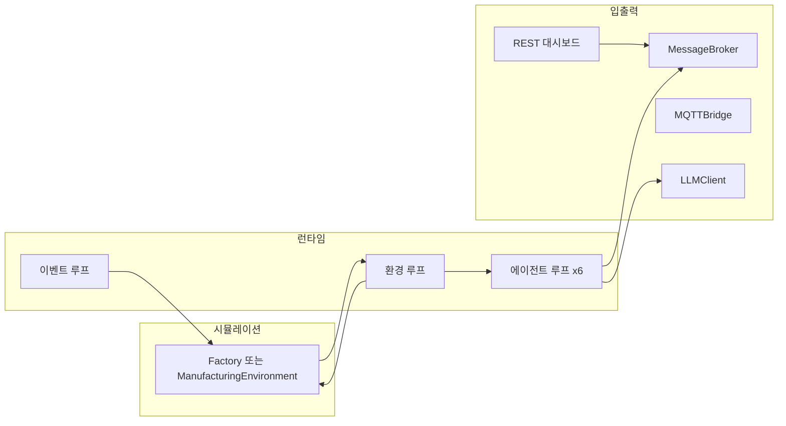
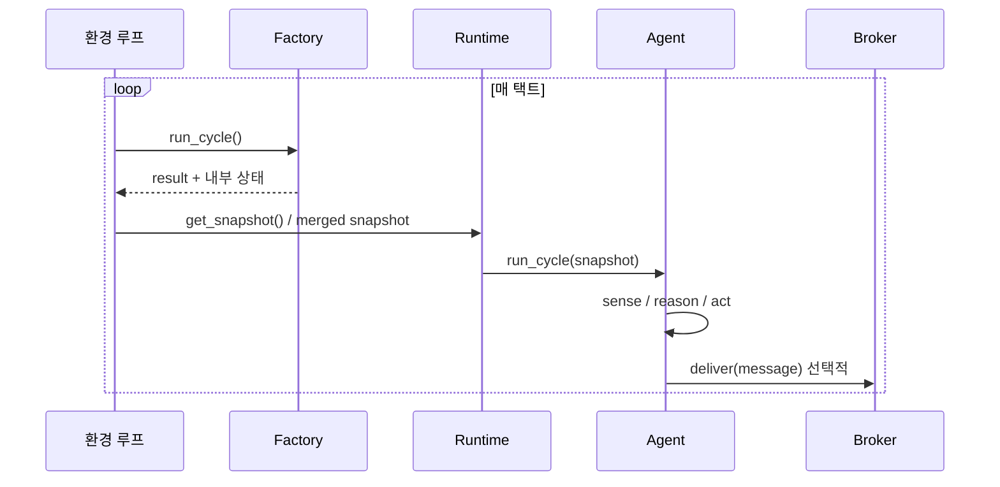

# Multi-Agent 제조 시뮬레이션 — 전체 동작 가이드

이 문서는 **코드 기준으로** 시스템이 어떻게 붙어 있고, 어떤 순서로 돌아가는지 정리한 기술 문서입니다.  
비유 중심 설명은 [OVERVIEW.md](OVERVIEW.md), 도식·모듈 상세는 [ARCHITECTURE.md](ARCHITECTURE.md)를 참고하면 됩니다.

---

## 목차

1. [한눈에 보기](#1-한눈에-보기)
2. [두 가지 실행 방식](#2-두-가지-실행-방식)
3. [구성 요소와 역할](#3-구성-요소와-역할)
4. [`python main.py` 동작](#4-python-mainpy-동작)
5. [`python run_scenario.py` 동작](#5-python-run_scenariopy-동작)
6. [스레드와 동시성](#6-스레드와-동시성)
7. [데이터 흐름: 스냅샷 → 에이전트](#7-데이터-흐름-스냅샷--에이전트)
8. [인프라: 브로커 · MQTT · LLM · API](#8-인프라-브로커--mqtt--llm--api)
9. [설정: `.env`와 환경 변수](#9-설정-env와-환경-변수)
10. [시나리오 YAML](#10-시나리오-yaml)
11. [CNP(협상) 흐름](#11-cnp협상-흐름)
12. [결과물과 비교 도구](#12-결과물과-비교-도구)
13. [주요 파일 맵](#13-주요-파일-맵)

---

## 1. 한눈에 보기

이 프로젝트는 **자동차 부품 공장(6공정 라인)**을 시뮬레이션하고, **6종 AI 에이전트**가 주기적으로 공장 상태를 읽고 판단하며, 필요 시 **계획 에이전트(PA)**가 **CNP(Contract Net Protocol) 스타일 협상**으로 라인 속도 등을 조정하는 구조입니다.

- **공장 쪽**은 매 택트(초 단위)마다 생산 1사이클을 진행하고, 스냅샷(센서·재고·KPI 등)을 갱신합니다.
- **에이전트 쪽**은 스냅샷을 받아 Sense → Reason → Act를 수행하고, 메시지는 **브로커**를 통해 오갑니다.
- **PA**만 LLM(또는 규칙)으로 CNP 종합 전략을 세울 수 있습니다.

---

## 2. 두 가지 실행 방식

| 구분 | 명령 | 공장 모델 | 런타임 클래스 | 끝나는 조건 |
|------|------|-----------|----------------|-------------|
| **대화형 / 모니터링** | `python main.py` | `Factory` (기본 주문·자재) | `FactoryRuntime` | **Ctrl+C** 할 때까지 무한 |
| **배치 / 실험** | `python run_scenario.py -s scenarios/normal.yaml -c N` | `ManufacturingEnvironment` (YAML 주입) | `AgentRuntime` | **N 사이클** 도달 또는 Ctrl+C |

- **main**: 터미널에 MES 스타일 로그·요약을 계속 출력하고, 선택적으로 **웹 대시보드**(`MAS_API_PORT`, 기본 8787)를 띄웁니다.
- **run_scenario**: `results/` 아래에 **JSON 결과**를 남기고 종료합니다. 시나리오별 KPI 비교에 쓰입니다.

---

## 3. 구성 요소와 역할

### 3.1 공장 (`mas/environment.py` — `Factory`)

- 6공정 워크센터, WIP, 자재, 교대, 완제품·폐기·재작업 카운터 등을 시뮬레이션합니다.
- `run_cycle()` 한 번이 “생산 1사이클”에 해당하고, `get_snapshot()` / `get_kpi_summary()`로 에이전트·API용 딕셔너리를 제공합니다.

### 3.2 시나리오 환경 (`mas/manufacturing_env.py` — `ManufacturingEnvironment`)

- `Factory` + **완제품 창고**(`FinishedGoodsWarehouse`) + **수요 모델**(`DemandModel`)을 묶습니다.
- YAML의 창고·센서·자재 파라미터를 반영하고, 양품 입고·출하 처리로 **서비스 레벨·안전재고 위반** 등을 추적합니다.

### 3.3 에이전트 6종 (`mas/*_agent.py`, `planning_agent.py`)

| ID | 역할 요약 |
|----|-----------|
| EA | 설비·센서·예지보전 |
| QA | 품질·SPC·불량 위험 |
| SA | 자재·공급 |
| DA | 수요·주문 변동 |
| IA | 재고·안전재고 |
| PA | 종합 계획·CNP 주관·LLM/규칙 전략 |

공통 부모는 `BaseAgent`: `run_cycle(snapshot)` → sense → reason → act.

### 3.4 메시지 브로커 (`mas/broker.py`)

- 토픽 기반 **인메모리 Pub/Sub**입니다. 에이전트 간 `AgentMessage` 라우팅, DLQ, 지연 메트릭을 담당합니다.
- 실제 Kafka/MQTT와 1:1은 아니지만, **동일한 “발행·구독” 개념**을 코드 안에서 재현합니다.

### 3.5 MQTT 브리지 (`mas/mqtt_bridge.py`)

- **옵션**입니다. `paho-mqtt`가 있고 `localhost:1883`(기본) 등에 **MQTT 브로커**가 떠 있으면 연결해 센서 토픽을 주고받습니다.
- 연결 실패 시 **내부 모드**: 네트워크 없이 메모리 콜백만 사용합니다. 시뮬 자체는 동작합니다.

### 3.6 지능 층 — LLM·솔버·도메인 신호

- **오케스트레이션 LLM** (`LLMClient`): 상황 분석(`analyze_situation`), CNP 시 **근거·리스크·SS 영향 서술**(`rationalize_cnp_decision`). 프롬프트 스위트 버전은 `mas/prompt_registry.py`에 고정한다.
- **수치·승자 선정** (`mas/optimization_engine.py`): CNP에서 `target_speed_pct`·최우선 제안은 **결정론적 솔버**(`cnp_numeric_strategy`)가 고정하고, LLM 출력과 병합할 때 수치 키는 솔버가 우선한다.
- **도메인 신호** (`mas/domain_inference.py`): 불량 위험·RUL 대역을 현재는 규칙으로 산출; 추후 소형 분류/RUL 모델·API로 교체 가능한 동일 인터페이스.
- 설정: `MAS_LLM_MODEL`(오케스트레이터), 선택적 `MAS_LLM_DOMAIN_MODEL`(전용 모델명 메타). `OPENAI_API_KEY` 없으면 솔버·규칙 폴백.

### 3.7 REST API + 대시보드 (`mas/api/server.py`)

- FastAPI + HTML/JS 대시보드, KPI·에이전트·브로커·**통합 모니터링**·SSE 스트림.
- **`GET /api/monitoring`**: 공장 요약, 라우터용 스냅샷(진동·유온·자재 버퍼), 전 에이전트 상세(`recent_reasoning`, 최근 판단, PA는 CNP·전략 요약), LLM·`HybridDecisionRouter` 메트릭, 런타임 이벤트/CNP 횟수.
- **`GET /api/router`**: 하이브리드 라우터 단독 JSON.
- **`GET /api/stream`**: 브로커 메시지 외 **`factory_tick`**(환경 루프가 ~1.5초마다 푸시 — 사이클·시계·OEE·완제품·교대).
- `MAS_API_BEARER_TOKEN`이 설정되어 있으면 `/api/*`에 Bearer 또는 `?token=` 검사(루트 `/` 등은 예외).

---

## 4. `python main.py` 동작

순서는 다음과 같습니다.

1. **`get_settings()`** — 프로젝트 루트 `.env`를 읽고 `MAS_*` 및 기타 변수 적용.
2. **`setup_logging()`** — stderr 로깅.
3. **`MessageBroker`**, **`MQTTBridge`**, **`LLMClient`**, **`HybridDecisionRouter(llm_client=llm)`** 생성.
4. **`MASApiServer`** — FastAPI 미설치/포트 실패 시 생략.
5. **`Factory()`** 생성 후 6에이전트 생성·`broker.register`·`mqtt` 연결.
6. **`FactoryRuntime(..., decision_router=decision_router)`** — `start()` 시 백그라운드 스레드 기동.
7. API가 있으면 `bind` + `start()` 후 메인 스레드에서 **1초마다** `factory.cycle` 증가 시 로그 출력·주기 요약.

택트 간격은 **`MAS_TAKT_SEC`**(기본 2.0초)이며 `mas/runtime/factory_runtime.py`의 `TAKT_SEC`로 `FactoryRuntime` 환경 루프에 사용됩니다.

---

## 5. `python run_scenario.py` 동작

1. **`ScenarioConfig.load(path)`** — YAML 파싱.
2. **`ManufacturingEnvironment(scenario)`** — 창고·수요·공장·센서/자재 반영.
3. **`ToolRegistry`**, **`HybridDecisionRouter`**, **`LLMClient`** 준비(시나리오 러너에서 주입).
4. 초기 고객 주문을 `env.demand`에 적재, 창고 파라미터 재계산.
5. **`AgentRuntime(env, broker, agents, …, scenario=sc)`** — `start()` 후 메인 스레드는 `max_cycles`까지 대기.
6. 종료 시 **`get_results()`**로 딕셔너리 수집 → `results/<시나리오명>_<타임스탬프>.json` 저장.

환경 루프에서는 `Factory.run_cycle()` 후 양품이면 창고 입고, 출하 간격에 맞춰 `process_shipments`로 **서비스 레벨**을 갱신합니다.

---

## 6. 스레드와 동시성

### 6.1 `FactoryRuntime` (main.py)

| 스레드 이름 | 역할 |
|-------------|------|
| `ENV-TICK` | `factory.run_cycle()` + 스냅샷 갱신 + MQTT publish 시도 + 동역학 |
| `EVENT-GEN` | 랜덤 이벤트(고장·신규주문·자재입고 등) |
| `AGENT-<ID>` ×6 | 에이전트별 주기로 `run_cycle(snapshot)` (PA는 CNP 분기) |

- 스냅샷과 로그 버퍼는 **락**으로 보호합니다.
- **에이전트는 같은 `Factory` 스냅샷 읽기 전용**에 가깝고, PA가 CNP 시에만 라인 `set_speed` 등으로 공장 상태를 바꿉니다.

### 6.2 `AgentRuntime` (run_scenario)

동일한 패턴이며, 스냅샷 소스가 **`env.get_merged_snapshot()`**이고 택트는 **`scenario.takt_sec`**입니다.

---

## 7. 데이터 흐름: 스냅샷 → 에이전트

- 에이전트는 **항상 최신 스냅샷**을 주기적으로 받습니다(스레드 타이밍에 따라 한두 택트 지연 가능).
- **브로커 메시지**는 다른 에이전트 알림·CNP 등에 사용됩니다.

### 7.1 라우터 통합 SRA · CNP 세션 · 스냅샷 보강 (2단계)

- **Sense → HybridDecisionRouter → Reason → Act** (`mas/protocol/agent_protocol.py`의 `run_cycle_with_router`, 프로토콜 ID `mas.sra.v2`): 기본 구현은 **LangGraph** 상태 그래프(`mas/protocol/sra_langgraph.py`: `sense` → `enrich` → `router` → `reason` → `act`). `MAS_USE_LANGGRAPH=0` 이거나 `langgraph` 미설치 시 동일 의미의 순차 구현으로 폴백합니다.
- **에이전트 입력 보강(1단계)** — `enrich_snapshot_for_agents()` (`mas/domain/agent_snapshot.py`): raw `get_snapshot()`에 `manufacturing_context`(계약 v2, `ingest_time_utc_iso` 포함)를 붙입니다. 공장 스냅샷에는 **`business_events`**(최근 비즈니스 이벤트 테일)가 포함될 수 있습니다.
- **라우터용 보강(2단계)** — `enrich_snapshot_for_router()` (`mas/intelligence/snapshot_enrichment.py`): 라우터가 쓰는 파생 지표를 추가한 뒤 `HybridDecisionRouter.route`가 **다음 행동**(예: `PA_CNP`, `PA_STRATEGY`, `EA_ALERT`)을 선택합니다. EA가 PA에게 보낸 **미처리 알림**(`new_alerts`)은 라우터 조건에도 반영됩니다.
- **CNP**: `CNPSession`(`mas/cnp_session.py`)으로 라운드·제안 속도·전략을 검증·클램프하고, `initiate_cnp` 시 브로커에 **`Intent.CFP`**를 발행합니다. 런타임은 CNP 호출 시 **`enrich_snapshot_for_agents`**가 적용된 스냅샷을 넘깁니다. EA·QA 등의 `handle_cfp`는 `mas/protocol/cnp_comparison.py`의 **`merge_into_proposal`**로 제안에 **`comparison`** 블록을 병합할 수 있으며, PA는 **`rank_proposals_by_comparison`** 등으로 순위를 정리합니다. 통합 전략에는 **`operational_decision_card`**(`mas/intelligence/operational_decision_card.py`)가 붙을 수 있습니다.
- **Planning Agent** 내부 모듈: `mas/agents/planning_sub/`(수집·순위·평가·리포트), QA 보조: `mas/agents/qa_sub/`(스텁 확장용).
- **Planning Agent**는 `run_cycle_with_router` 경로에서 CNP 분기 시 동일한 프로토콜을 사용합니다(`mas/agents/planning_agent.py`, `mas/runtime/factory_runtime.py`).

---

## 8. 인프라: 브로커 · MQTT · LLM · API

- **브로커**: 에이전트 간 메시지와 메트릭의 중심. API의 SSE는 브로커 콜백으로 이벤트를 밀어 넣습니다.
- **MQTT**: 실제 브로커가 없으면 “내부 모드”로 동작해도 **시뮬 로직은 동일**합니다.
- **LLM**: PA의 전략/CNP 평가 등에 사용. 키 없으면 규칙 분기. `LLMClient`는 호출 메타를 **`audit_log`**(상한 있음)에 누적합니다.
- **API**: 공장 스냅샷·KPI·에이전트 상태·브로커 메트릭 조회 및 실시간 메시지 스트림.

---

## 9. 설정: `.env`와 환경 변수

프로젝트 루트 `.env`는 **`mas/config.py`가 부팅 시 한 번 읽어** `os.environ`에 넣습니다(이미 OS에 있는 키는 덮어쓰지 않음).

| 변수 | 의미 | 기본 |
|------|------|------|
| `MAS_API_PORT` | REST 대시보드 포트 | 8787 |
| `MAS_TAKT_SEC` | main의 공장 환경 루프 대기(초) | 2.0 |
| `MAS_LLM_MODEL` | OpenAI 모델명 | gpt-4o-mini |
| `MAS_LOG_LEVEL` | 로깅 레벨 | INFO |
| `MAS_API_BEARER_TOKEN` | 설정 시 `/api/*` 보호 | 비어 있으면 미사용 |
| `MAS_CORS_ORIGINS` | CORS Origin(쉼표 또는 `*`) | * |
| `OPENAI_API_KEY` | OpenAI API 키(LLM용, `MAS_` 접두사 없음) | — |

자세한 예시는 [`.env.example`](.env.example)를 참고하면 됩니다.

---

## 10. 시나리오 YAML

- 위치: `scenarios/*.yaml`
- `ScenarioConfig`가 읽는 주요 블록: `sensors`(프레스/용접), `warehouse`, `materials`, `demand`, `events`, `runtime`, `execution.max_cycles` 등.
- `python run_scenario.py --list`로 목록 확인.

---

## 11. CNP(협상) 흐름

1. PA가 스냅샷·수신 알림을 보고 **CNP 개시** 조건이면 `initiate_cnp: True`.
2. 다른 에이전트에 **CFP**에 해당하는 제안 요청 → 각자 `handle_cfp`로 제안(`merge_into_proposal`로 비교 메트릭 선택적 병합).
3. PA가 점수/규칙/LLM으로 **통합 전략** 결정 → `operational_decision_card`·`pa_report_lines` 등 포함 가능 → 라인 속도 등 적용.

세부 의도 타입은 `mas/message.py`의 `Intent`와 브로커 토픽 매핑을 따릅니다.

---

## 12. 결과물과 비교 도구

- **시나리오 실행**: `results/<이름>_<날짜시간>.json` — 총 사이클, 이벤트 수, CNP 횟수, 창고 KPI, 브로커 메트릭, 도구/라우터 요약 등.
- **비교**: `python compare_results.py results/*.json` — 터미널 표로 나란히 비교.

`.gitignore`에 `results/`가 있으면 Git에는 기본적으로 올라가지 않습니다.

---

## 13. 주요 모듈 맵 (레이어)

| 경로 | 역할 |
|------|------|
| `main.py` | 무한 실행 진입점 |
| `run_scenario.py` | YAML 배치 실행 |
| `compare_results.py` | JSON 결과 비교 CLI |
| `mas/core/` | 설정(`config`), 로깅 |
| `mas/domain/` | `Factory`, 기계·재고·수요, `ManufacturingEnvironment` |
| `mas/messaging/` | 메시지·브로커·MQTT |
| `mas/agents/` | `BaseAgent` 및 6종 에이전트 |
| `mas/intelligence/` | LLM·라우터·솔버·도메인 추론 |
| `mas/protocol/` | CNP 세션, SRA, LangGraph(`sra_langgraph`), `cnp_comparison` |
| `mas/adapters/` | 외부 시스템 연동용 Protocol 정의(`base.py`) |
| `mas/runtime/` | `factory_runtime`(FactoryRuntime·콘솔), `scenario_runtime`(AgentRuntime) |
| `mas/scenario/` | YAML → `ScenarioConfig` (`loader.py`) |
| `mas/tools/` | ToolRegistry, mock_models |
| `mas/api/` | FastAPI + 대시보드 (`server.py`, `/api/monitoring` 등) |
| `mas/*.py`(루트 shim) | 기존 `from mas.config` 등 **하위 호환** 재export |
| `scenarios/` | 시나리오 정의 |

---

## 요약

- **main** = 인터랙티브 공장 시뮬 + 선택적 웹 UI.  
- **run_scenario** = YAML 실험 + JSON 리포트.  
- **에이전트**는 스냅샷 기반 주기 루프, **PA**가 CNP·LLM으로 조율.  
- **MQTT·실제 브로커**는 없어도 되고, **OpenAI 키**는 LLM 쓸 때만 `.env`의 `OPENAI_API_KEY`로 설정하면 됩니다.

이 문서는 코드 구조가 바뀔 때마다 **이 파일을 기준으로** 갱신하는 것이 좋습니다.
